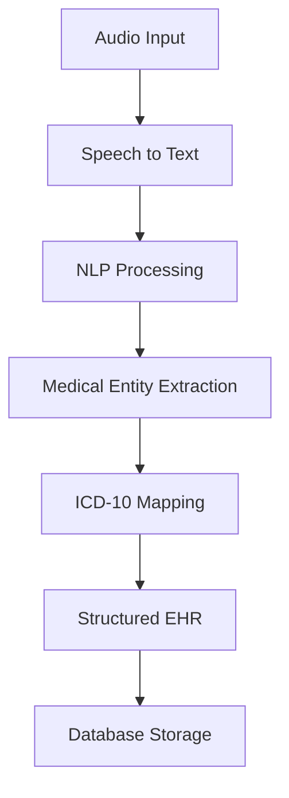

# 🏥 CareBridgeAI

## 📌 Overview

**CareBridgeAI** is an AI-powered healthcare system that converts doctor–patient voice conversations into structured **Electronic Health Records (EHR)**.
It automates clinical documentation by combining **Speech Recognition, Natural Language Processing (NLP), and ICD-10 mapping**.

The system reduces manual effort for healthcare professionals while improving the accuracy and consistency of patient records.

## 🎯 Objectives

* 📄 Automatically generate **Electronic Health Records (EHR)**
* 🎤 Convert doctor–patient conversations into text
* 🧠 Extract medical entities (diseases, symptoms, medications)
* 🏷️ Map diseases to **ICD-10 codes**
* ⚡ Reduce workload for healthcare professionals
* 🎯 Improve accuracy and standardization of medical data

## ⚙️ Core Workflow



## 🧩 Features Implemented

### 🎤 Speech-to-Text

* Converts audio input into text transcription

### 🧠 NLP Processing

* Extracts:

  * Diseases
  * Symptoms
  * Medications

### 🏷️ ICD-10 Mapping

* Maps extracted diseases to standard ICD-10 codes

### 🗄️ EHR Management

* Stores structured patient records in database
* Supports:

  * Save record
  * Fetch all records
  * Fetch records by patient ID

### 🔗 Unified Pipeline

* End-to-end flow:
  **Audio → Text → NLP → ICD → EHR → Database**

## 🛠️ Tech Stack

### Backend

* Java (Spring Boot)
* REST APIs

### AI / NLP

* Custom NLP
* Text Processing

### Database

* JPA / Hibernate
* MySQL (or compatible DB)

### Other Tools

* Postman (API testing)
* Maven

## 📂 Project Structure

```
com.carebridge
│
├── controller        # REST Controllers
├── service           # Business Logic (Speech, NLP, ICD, EHR)
├── repository        # Database Layer
├── entity            # EHR & ICD Models
├── DTO               # Data Transfer Objects
```

## 🚀 API Endpoints

### 🔹 Process Audio (Full Pipeline)

```
POST /ehr/process-audio
```

* Input: Audio file (multipart/form-data)
* Output: Structured EHR

### 🔹 Save Record (Text Input)

```
POST /ehr/save
```

### 🔹 Get All Records

```
GET /ehr/all
```

### 🔹 Get Records by Patient ID

```
GET /ehr/patient/{id}
```

## 🧪 Sample Output

```json
{
  "patientName": "Auto Generated",
  "diagnosis": "cholera",
  "symptoms": "diarrhea, dehydration",
  "icdCode": "A00"
}
```

## 🚧 Current Status

* ✅ Speech-to-Text integration completed
* ✅ NLP-based medical extraction implemented
* ✅ ICD-10 mapping integrated
* ✅ End-to-end pipeline working
* 🚧 Improving accuracy & normalization
* 🚧 Enhancing multi-disease support


## 🔮 Future Enhancements

* 🧠 AI-based disease inference (even without diagnosis)
* 📊 Patient triage & priority queue system
* 🌐 Frontend dashboard for hospitals
* 📱 Real-time audio streaming support
* 🔍 Advanced ICD matching (fuzzy search / ML)
* 🧾 Multi-language support (Hindi + English)
